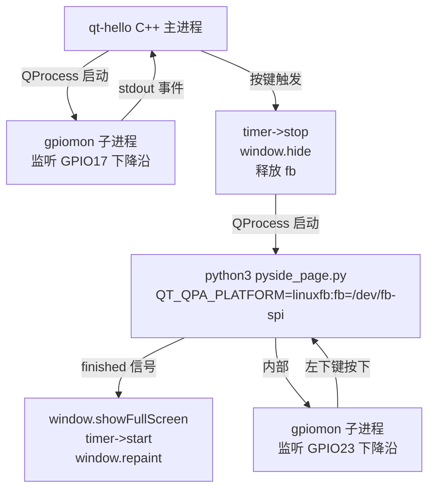

# Qt C++ Launcher + 独立 PySide6 子进程架构 POC 调研报告

> 验证日期：2026-05-07
> 硬件：Raspberry Pi CM5，320×240 SPI LCD（`/dev/fb-spi`）
> 结论：**方案可行，端到端启动延迟 ~85 ms，完全满足交互需求。**

---

## 1. 背景与目标

现有一批 Python 写的示例程序（如 `XGO-PI-CM5/common/demos/run_blockly.py`），
它们基于 PIL + 自研 LCD 驱动直写 framebuffer。后续计划把 GUI 统一到 Qt：

- **主 launcher** 用 Qt C++（就是当前 `/home/pi/qt-hello`）
- **每个功能页面**用 **独立 PySide6 进程**，通过按键触发启动，退出后回到 launcher
- 未来接 HDMI 标准桌面时，依托 `/dev/fb-spi` udev 软链接规范，应用层零改动

本次 POC 用最小例子验证该架构的**可行性和性能**。

## 2. 技术方案



### 2.1 关键设计点

| 设计 | 理由 |
|---|---|
| 用 `gpiomon` 作为 `QProcess` 子进程 | 比轮询 sysfs / pinctrl 零 CPU 占用；事件驱动，延迟极低 |
| 事件以 stdout 行方式回传 | 天然融入 Qt 事件循环（`readyReadStandardOutput` 信号）|
| 启动 PySide6 前 `timer->stop() + window.hide()` | linuxfb 无合成器，两个进程抢 fb 会互相覆盖；必须串行 |
| PySide6 退出后 `showFullScreen() + repaint()` | 恢复主界面，避免脏 fb |
| PySide6 侧 30 秒自动退出兜底 | 防止 gpiomon 失效时用户按不出去 |

### 2.2 按键 → GPIO 映射（踩坑要点）

来自 `XGO-PI-CM5/uiutils/__init__.py`：
```python
self.keys = {"A": 24, "B": 23, "C": 17, "D": 22}
```
**代码键名和面板标签是同名但"错位"的**，必须以面板标签和**物理位置**为准：

| 物理位置 | 面板标签 | GPIO | 本项目用途 |
|---|---|---|---|
| 左上 | A | **17** | qt-hello 主进程监听 → 启动 PySide6 |
| 右上 | B | 22 | （未用）|
| 右下 | C | 24 | （未用）|
| 左下 | D | **23** | PySide6 页面监听 → 退出 |

> ⚠️ **坑**：第一版把左下误写成 GPIO 22（右上），导致退出键不生效，30 秒兜底才退。确认方法：查 `run_blockly.py` 注释 `press_b()=物理左下D键` → `press_button("B")` → `keys["B"]=23`。

## 3. 关键文件

| 文件 | 作用 |
|---|---|
| [main.cpp](./main.cpp) | Qt C++ 主进程：时间显示 + gpiomon 监听 + QProcess 启动 PySide6 + fb 接力 |
| [pyside_page.py](./pyside_page.py) | 独立 PySide6 全屏页面：计数器、分阶段启动耗时日志、退出键监听 |
| [CMakeLists.txt](./CMakeLists.txt) | 未改，仍只依赖 `Qt6::Widgets` |
| `/etc/systemd/system/qt-hello.service` | User=pi，`QT_QPA_PLATFORM=linuxfb:fb=/dev/fb-spi` |

## 4. 环境依赖

- Qt6 C++（已装，系统包）
- `python3-pyside6`（通过 `apt install python3-pyside6` 安装，版本 6.8.2）
- `libgpiod` / `gpiomon`（Debian trixie 自带，pi 用户在 `gpio` 组，无需 sudo）

## 5. 性能实测

### 5.1 端到端启动耗时

实测数据（来自 journal log，按一次左上键触发）：

| 阶段 | 耗时 | 累计 |
|---|---|---|
| GPIO 事件到达 → `QProcess::start()` 返回 | 1 ms | 1 ms |
| `started` 信号（内核 fork+exec 完成）| 0 ms | 1 ms |
| Python 入口 → PySide6 import 完成 | +36 ms | 37 ms |
| → `QApplication` 构造 | +15 ms | 52 ms |
| → widget 构造（布局+子 QProcess+定时器）| +28 ms | 80 ms |
| → 首次 `paintEvent`（首帧上屏） | +5 ms | **85 ms** |

**结论**：肉眼几乎无感知延迟（人眼感知阈值约 100 ms）。

### 5.2 运行时表现

- PySide6 页面 50ms 定时器（20 fps）刷新 counter，SPI 屏显示流畅无撕裂
- qt-hello 主进程完全让出 fb，画面无冲突
- PySide6 退出后 qt-hello 主界面 `repaint()` 立即恢复

## 6. 日志规范

为后续复用这套模式，保留分阶段日志结构：

**C++ 侧**（qDebug，进入 journal）：
```
[qt-hello][<ms>] gpio<N> event: <raw line>
[qt-hello][<ms>] request -> launch PySide6
[qt-hello][<ms>] ui paused +Xms
[qt-hello][<ms>] QProcess::start() returned +Xms since request
[qt-hello][<ms>] PySide6 'started' signal after Xms (fork+exec)
[qt-hello][<ms>] PySide6 finished code=C status=S total=Tms
```

**Python 侧**（stdout，通过 `QProcess::ForwardedChannels` 进入 journal）：
```
[pyside_page][+  X.Xms] python entry
[pyside_page][+  X.Xms] PySide6 import done
[pyside_page][+  X.Xms] QApplication created
[pyside_page][+  X.Xms] widget constructed
[pyside_page][+  X.Xms] first paintEvent
[pyside_page][+  X.Xms] showFullScreen returned
[pyside_page] boot breakdown: <每阶段绝对/增量耗时>
```

首帧 paintEvent 时把 breakdown 直接显示到屏幕 info 行，不用连电脑也能读。

## 7. 已知问题与遗留点

| # | 项 | 说明 |
|---|---|---|
| 1 | `Failed to open tty (Permission denied)` | linuxfb 平台尝试接管 VT 的提示，无害，可通过给 pi 用户加 `tty` 组消除 |
| 2 | 两个 Qt 进程不能同时写 fb | 已通过 hide/show 串行化规避；未来切标准桌面（wayland/X11）后自动有合成器，该问题消失 |
| 3 | PySide6 冷启动受 OS 文件缓存影响 | 首次启动可能 > 200 ms，热缓存 ~85 ms；不影响可用性 |

## 8. 后续方向

该 POC 已证明方案可行，下一步可按以下路径推进：

1. **Launcher 面板化**：把 qt-hello 主页改成图标网格（`QGridLayout` + `QPushButton`），按键 A/B/C/D 选中/启动
2. **配置化应用清单**：JSON 描述每个可启动项（名称、图标、命令、参数、使用的 venv）
3. **首个真实页面**：把 `run_blockly.py` 按方案 B 重写为 PySide6 版本（UI 用 Qt，业务 `GracefulBlocklyService` / `ProgramRunner` 保留）
4. **进程生命周期**：主 launcher 维护子进程表，防止重复启动；记录退出码

---

## 附：复现步骤

```bash
# 1. 安装依赖（如未安装）
sudo apt install -y python3-pyside6

# 2. 构建
cd /home/pi/qt-hello/build && cmake --build .

# 3. 重启服务
sudo systemctl restart qt-hello.service

# 4. 观察日志
sudo journalctl -u qt-hello -f

# 5. 操作：按左上键进入 PySide6 页面，按左下键退出
```
